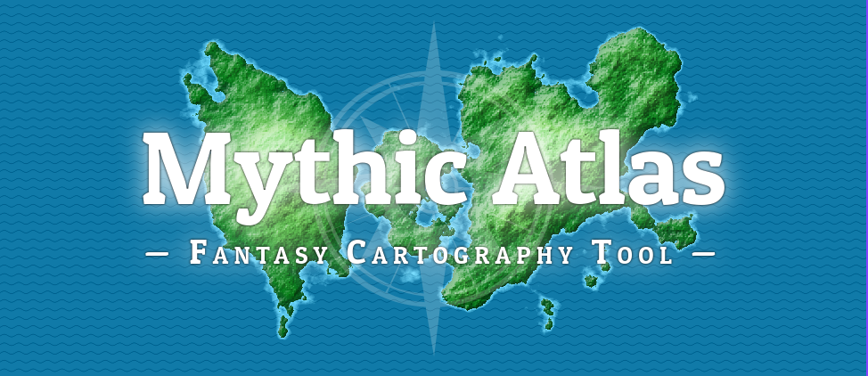
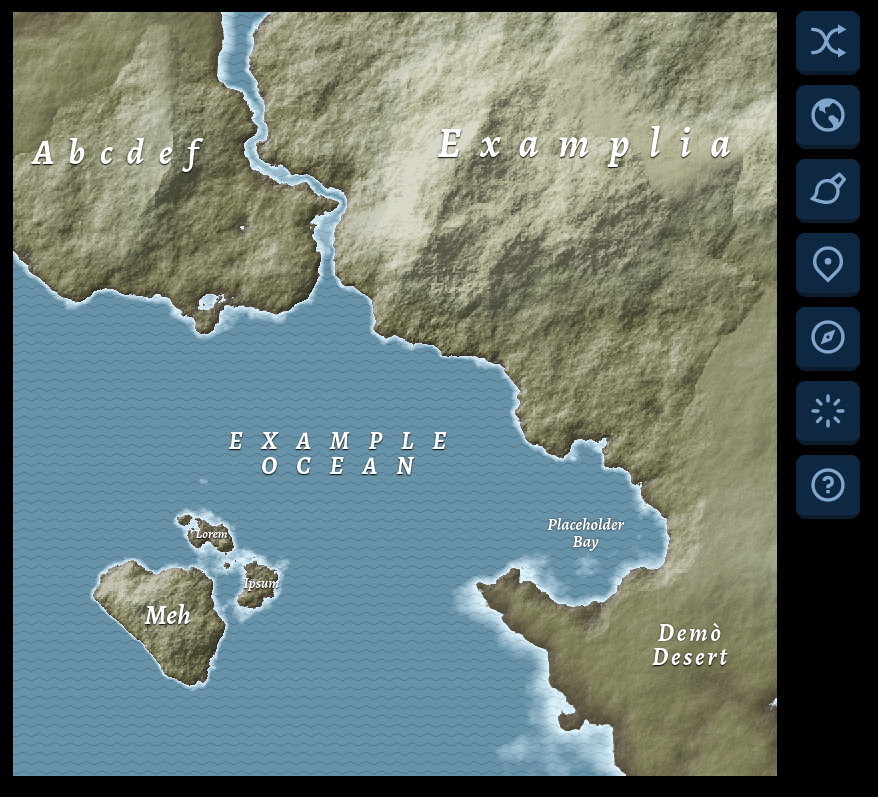
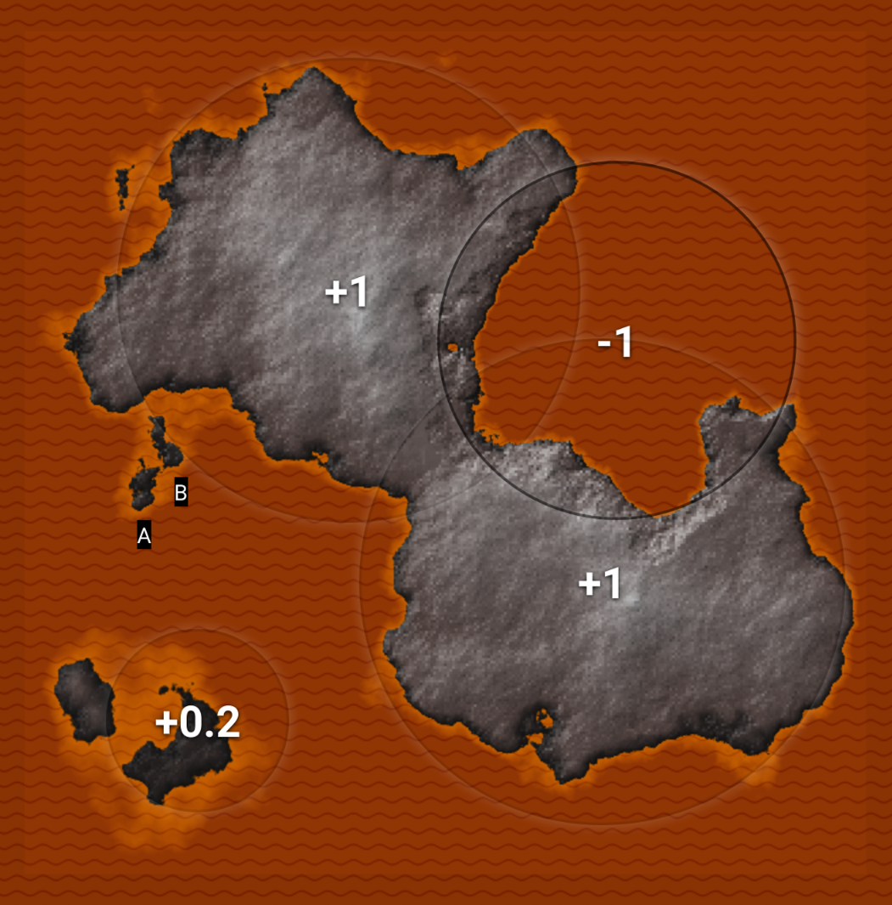

A real-time, non-destructive, web-based fantasy map editor.

:arrow_right: **[Try it in your browser!](https://www.mythicatlas.com)**

With **Mythic Atlas**, you can place markers to indicate where you want land
and sea, and **move them in real-time** without waiting around for the map to
generate.

If you have a general idea of how you want your map's land masses to be shaped,
but don't care about the details or realism, Mythic Atlas just might be the
tool for you.

**Project status**: very buggy and unfinished :bug::bug::hammer::triumph::bug::bug: (but still fun to play with!)

## Screenshots




## Run it locally

Install the dependencies...

```bash
npm install
```

...then start [Rollup](https://rollupjs.org):

```bash
npm run dev
```

Navigate to [localhost:5000](http://localhost:5000) to use the app.

## License

[MIT](LICENSE)
